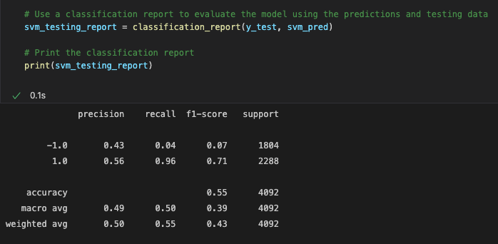

## ML_Trading_Bot

Financial Python programming and machine learning to create an algorithmic trading bot that learns and adapts to new data and evolving markets.

Please be sure to install all the prerequisites (libraries) before running the program:

- `pip install pandas`
- `pip install sklearn`

Here is an example of the `svm` classification report:

And here is an example of a plot showing the _Actual vs Strategy_ returns:

